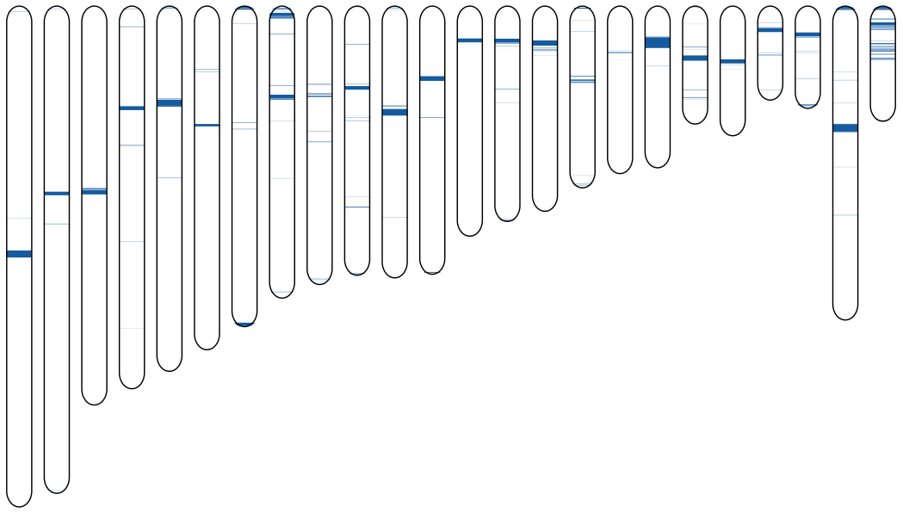

# CHESTER #

CHESTER is a probabilistic tool to map and visualize relative singularity regions.
The references can be non-aligned, such as those outputed directly from NGS plataforms (FASTQ), while the target sequences should be aligned (FASTA). CHESTER has a probabilistic way to detect the relative absense of large k-mer sizes (up to 30), namely using bloom filters. The bloom filters are set automatically.

## INSTALLATION ##

Cmake is needed for installation (http://www.cmake.org/). You can download it directly from http://www.cmake.org/cmake/resources/software.html or use an appropriate packet manager. In the following instructions we show the procedure to install, compile and run CHESTER:

### STEP 1

Download, install and resolve conflicts.

#### Linux 
<pre>
sudo apt-get install cmake
git clone https://github.com/pratas/chester.git
cd chester/src/
cmake .
make
</pre>

Alternatively, you can install (without cmake and git, but only for linux) using
<pre>
wget https://github.com/pratas/chester/archive/master.zip
unzip master.zip
cd chester-master/src/
mv Makefile.linux Makefile
make
</pre>

#### OS X
Install brew:
<pre>
ruby -e "$(curl -fsSL https://raw.github.com/Homebrew/homebrew/go/install)"
</pre>
only if you do not have it. After type:
<pre>
brew install cmake
brew install wget
brew install gcc48
wget https://github.com/pratas/chester/archive/master.zip
unzip master.zip
cd chester-master/src/
cmake .
make
</pre>
With some versions you might need to create a link to cc or gcc (after the *brew install gcc48* command), namely
<pre>
sudo mv /usr/bin/gcc /usr/bin/gcc-old   # gcc backup
sudo mv /usr/bin/cc /usr/bin/cc-old     # cc backup
sudo ln -s /usr/bin/gcc-4.8 /usr/bin/gcc
sudo ln -s /usr/bin/gcc-4.8 /usr/bin/cc
</pre>
In some versions, the gcc48 is installed over /usr/local/bin, therefore you might need to substitute the last two commands by the following two:
<pre>
sudo ln -s /usr/local/bin/gcc-4.8 /usr/bin/gcc
sudo ln -s /usr/local/bin/gcc-4.8 /usr/bin/cc
</pre>

#### Windows

In windows use cygwin (https://www.cygwin.com/) and make sure that it is included in the installation: cmake, make, zcat, unzip, wget, tr, grep (and any dependencies). If you install the complete cygwin packet then all these will be installed. After, all steps will be the same as in Linux.

## EXECUTION

Run CHESTER-map:

<pre>
./CHESTER-map -v -k 30 -i -t 0.5 -s 6099999999 File1.fastq:File2.fastq:File3.fasta FileA.fasta:FileB.fasta
</pre>

## PARAMETERS

To see the possible options type
<pre>
./CHESTER-map
</pre>
or
<pre>
./CHESTER-map -h
</pre>

These will print the following options:
<pre>
Usage: CHESTER-map &#60OPTIONS&#62... [FILE]:&#60...&#62 [FILE]:&#60...&#62
CHESTER-map: a tool to map relative singularity regions  
The (probabilistic) Bloom filter is automatically set.

  -v                       verbose mode,             
  -a                       about CHESTER,            
  -t &#60value&#62               threshold [0.0;1.0],      
  -w &#60value&#62               window size,              
  -u &#60value&#62               sub-sampling,             
  -s &#60value&#62               bloom size,               
  -i                       use inversions,           
  -p                       show positions/words,
  -k &#60value&#62               k-mer size (up to 30),               
                                                     
  [rFile1]:&#60rFile2&#62:&#60...&#62  reference file(s),   
  [tFile1]:&#60tFile2&#62:&#60...&#62  target file(s).           

The reference files may be FASTA, FASTQ or DNA-SEQ,
while the target files may be FASTA or DNA-SEQ.
Report bugs to &#60{pratas,ap,pjf}@ua.pt&#62. 
</pre>

Most of the values are set automatically. Nevertheless, higher threshold values are associated to more unique regions detected.

## EXAMPLE ##

The following illustrate a Human-Chimp (large) example. For the purpose go to the base and run:
<pre>
cp scripts/RunHumanChimp.sh .
cp scripts/GetHumanParse.sh .
cp scripts/GetChimpParse.sh .
. GetHumanParse.sh
. GetChimpParse.sh
. RunHumanChimp.sh &
</pre>

It will download all the sequences and run CHESTER-map.
This will output the plot.svg, with the human novel regions relatively to the chimpanzee, chromosome by chromosome. The next image illustrate such result:

The example image show most of the centromers contained in the chromosomes and several genes (present in human but not in chimpanzee).

## CITATION ##

On using this software/method please cite:

D. Pratas, R. M. Silva, A. J. Pinho, P. J. S. G. Ferreira, Detection and visualisation of regions of human DNA not present in other primates. Proceedings of the 21st Portuguese Conference on Pattern Recognition, RecPad 2015, Faro, Portugal, October 2015. 

(Best paper award of RecPad 2015)

[Download paper] (https://github.com/pratas/chester/blob/master/paper.pdf)

## ISSUES ##

For any issue let us know at [issues link](https://github.com/pratas/chester/issues).

## LICENSE ##

GPL v3.

For more information:
<pre>http://www.gnu.org/licenses/gpl-3.0.html</pre>

                                                    

